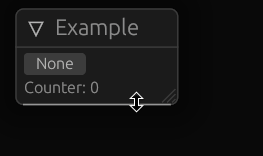

# egui-bind
Library for showing key and pointer binds



# Installation
```toml
[dependencies]
egui-bind = "0.14"

# Or if you wish for your binds to be serializable
# [dependencies]
# egui-bind = { version = "0.14", features = ["serde"] }
```

# Example
```rust
// Foreword: You can find this example in `examples/bind.rs`
#[derive(Default)]
struct ExampleApp {
    // This can also be serialized with `serde`. You just
    // need to enable `serde` feature.
    bind: Option<(KeyOrPointer, Modifiers)>,
    count: usize,
}

impl App for ExampleApp {
    fn update(&mut self, ctx: &Context, _: &mut Frame) {
        Window::new("Example")
            .show(ctx, |ui| {
                // Order matters, If you were to put this if case
                // after the bind was shown, then it would trigger `self.cout += 1`
                // on the same frame user assigned a new bind, which may not be the
                // desired behavior. But you can mitigate this by using the return
                // value of a `Bind::show` as shown below with `println!`.
                if self.bind.pressed(ui.input()) {
                    self.count += 1;
                }

                // `Bind::new` accepts a reference to a type that implements `BindTarget`
                // Most common of those are:
                // `Key`, `PointerButton`, `KeyOrPointer`, `(BindTarget, Modifiers)`
                // `Option<BindTarget>`
                let assigned = Bind::new("_test", &mut self.bind).show(ui);

                // Here it checks if the bind was pressed but not assigned on the same frame.
                if !assigned && self.bind.pressed(ui.input()) {
                    println!("I was pressed");
                }

                ui.label(format!("Counter: {}", self.count));
            });
    }
}
```
